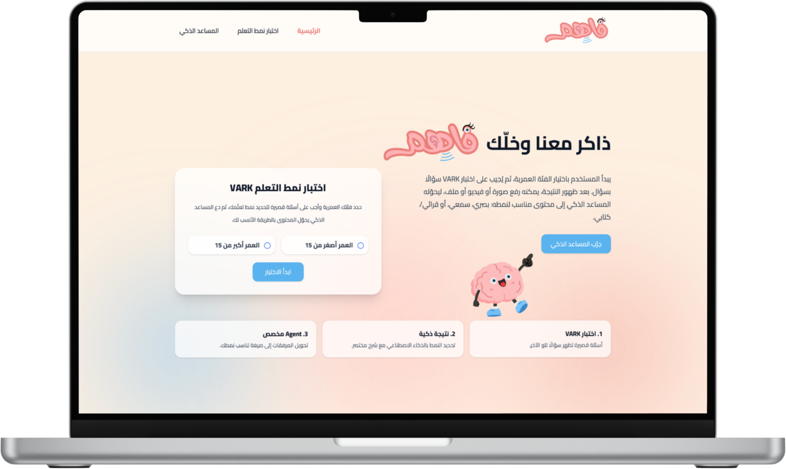
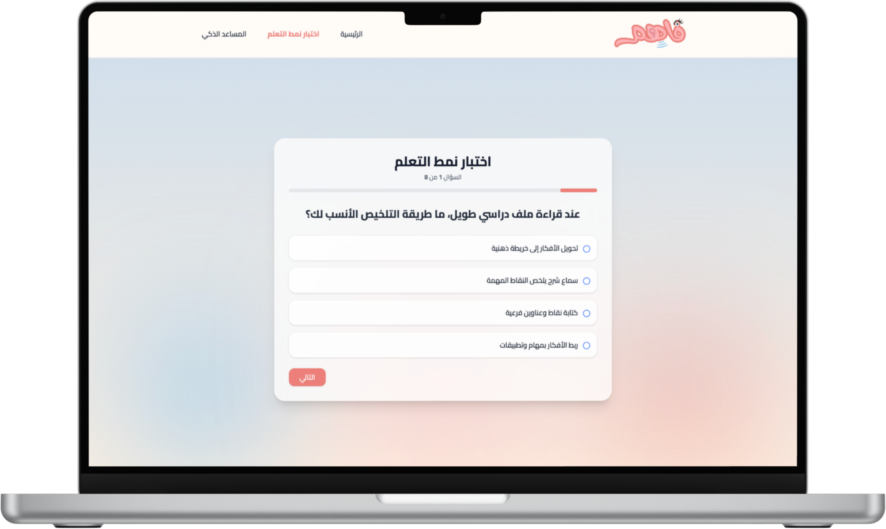
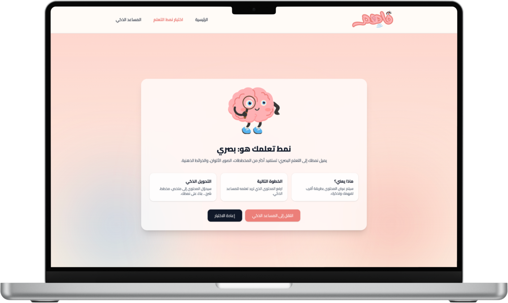
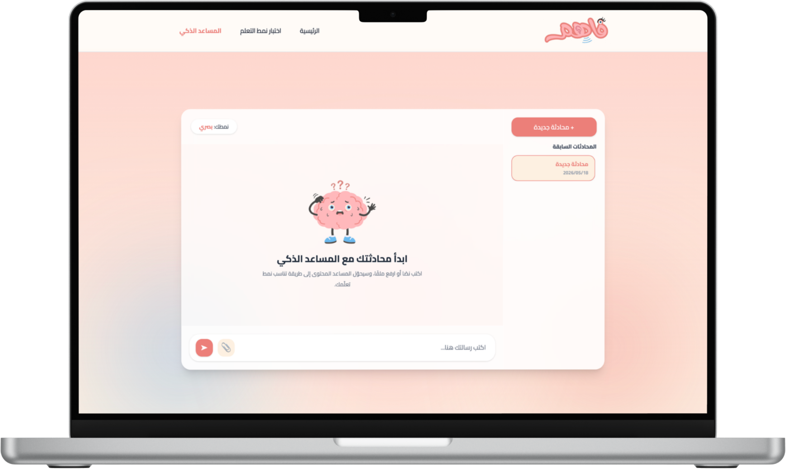

<div align="center">


# Fahem | Adaptive Learning Agent

### Learn in the way your mind understands best.

<p>
  
  
  
  
  
</p>

**Fahem** is an adaptive learning assistant that identifies the user's learning style and transforms educational content into a format that fits the learner best.

</div>

---

## ✨ Overview

Many learners do not struggle because the content is impossible to understand.  
They struggle because the content is often presented in a format that does not match the way they learn.

**Fahem** solves this by first identifying the user's learning style using a VARK-based test, then allowing the user to interact with an intelligent assistant that can transform learning content into a more personalized format.

---

## 🎯 Problem

Most educational platforms present the same content to everyone in the same way.  
However, learners understand information differently:

- Some understand better through diagrams and visual summaries.
- Some learn faster through audio explanations.
- Some prefer organized written notes.
- Some need examples, practice, and hands-on activities.

This one-size-fits-all approach may lead to:

- Lower understanding
- Lower engagement
- Repeated need for explanation
- Wasted time searching for alternative resources
- Frustration during self-learning

---

## 💡 Solution

Fahem provides a personalized learning experience through three main steps:

<ol>
  <li><b>Identify</b> the learner's preferred learning style through a VARK-based test.</li>
  <li><b>Receive</b> learning content from the user as text, file, image, audio, or notes.</li>
  <li><b>Transform</b> the content into a format that matches the learner's style.</li>
</ol>

---

## 🧠 Learning Styles

| Learning Style | Personalized Output |
|---|---|
| **Visual** | Diagrams, mind maps, visual summaries |
| **Auditory** | Audio explanations, podcast-style scripts |
| **Read / Write** | Organized notes, summaries, bullet points |
---

## 🖼️ Project Interfaces

<div align="center">

### Home Page


<br /><br />

### Learning Style Test


<br /><br />

### Learning Style Result


<br /><br />

### Intelligent Assistant Chat


</div>

---

## 🚀 Main Features

<ul>
  <li>VARK-based learning style test</li>
  <li>Personalized learning style result</li>
  <li>AI assistant chat interface</li>
  <li>Previous chat sessions sidebar</li>
  <li>File upload support inside the chat</li>
  <li>Post-content understanding assessment</li>
</ul>

### Agent Services

<ul>
  <li><b>File to Text Service:</b> extracts text from uploaded files such as PDF, DOCX, PPTX, TXT, and supported document formats.</li>
  <li><b>Text Formatter Service:</b> cleans, restructures, and formats extracted text using AI.</li>
  <li><b>Audio Generator Service:</b> converts text into an audio explanation suitable for auditory learners.</li>
  <li><b>Image Generator Service:</b> generates visual learning content such as diagrams or educational images.</li>
  <li><b>Image to Text Service:</b> extracts text from images, screenshots, or visual documents.</li>
  <li><b>Speech to Text Service:</b> converts uploaded audio files into text.</li>
  <li><b>Response Router Service:</b> routes the user request to the most suitable service based on the message, attachment, and learning style.</li>
</ul>
---

## 🔄 System Flow

```text
Select age group
        ↓
Take VARK learning style test
        ↓
Identify learning style
        ↓
Open intelligent assistant
        ↓
Enter text or upload file
        ↓
Analyze content
        ↓
Transform content based on learning style
        ↓
Return personalized learning output
        ↓
Assess learner understanding
        ↓
Evaluate performance
```

---

## 🛠️ Tech Stack

| Area | Tools |
|---|---|
| Backend | Python, Django |
| Database | SQLite |
| Frontend | Django Templates, HTML, CSS, Tailwind CSS |
| AI Services | OpenAI API |
| File Processing | Docling |
| Speech-to-Text | Whisper |
| Image Processing| Mistral AI, Graphviz.|
| Text-to-Speech | Edge TTS |
| Image Generator | PIL image |
| Version Control | Git, GitHub |

---

## 📁 Project Structure

```text
aai-capstone-project/
├── backend/
│   ├── agents/
│   │   ├── models.py
│   │   ├── views.py
│   │   ├── urls.py
│   │   ├── templates/agents/
│   │   └── services/
│   │       ├── audio_generator.py
│   │       ├── image_generator.py
│   │       ├── learner_evaluator.py
│   │       ├── file_to_text.py
│   │       ├── speech_to_text.py
│   │       ├── image_to_text.py
│   │       ├── file_generator.py
│   │       └── response_router.py
│   │
│   ├── learning_test/
│   │   ├── models.py
│   │   ├── views.py
│   │   ├── urls.py
│   │   ├── question_banks.py
│   │   └── templates/learning_test/
│   │
│   ├── main/
│   ├── config/
│   ├── static/images/
│   └── manage.py
│
├── requirements.txt
├── README.md
├── .gitignore
└── .env.example
```

---

## ⚙️ Local Setup

### 1. Clone the repository

```bash
git clone <repo-url>
cd aai-capstone-project
```

### 2. Create and activate a virtual environment

```bash
python3 -m venv .venv
source .venv/bin/activate
```

### 3. Install dependencies

```bash
pip install -r requirements.txt
```

### 4. Run the project

```bash
cd backend
python3 manage.py migrate
python3 manage.py runserver
```

Open:

```text
http://127.0.0.1:8000/
```

---

## 🔐 Environment Variables

Create a local `.env` file:

```env
SECRET_KEY=your-secret-key-here
DEBUG=True
OPENAI_API_KEY=your-openai-api-key-here
```

---

## 👥 Team members

| Name | Role |
|---|---|
| `Lama Alfreah` | Full Django setup, UI design and templates, database models, VARK test, file-to-text, AI text formatting and audio generation |
| `Reem Alyahya` | Image to Text, Speech to Text, Learner Evaluator and file generator |
| `Hissah Alkharboush` | Image generation and response router integration |

---

<div align="center">

**Fahem explains content in the way each learner understands best :)**

</div>
